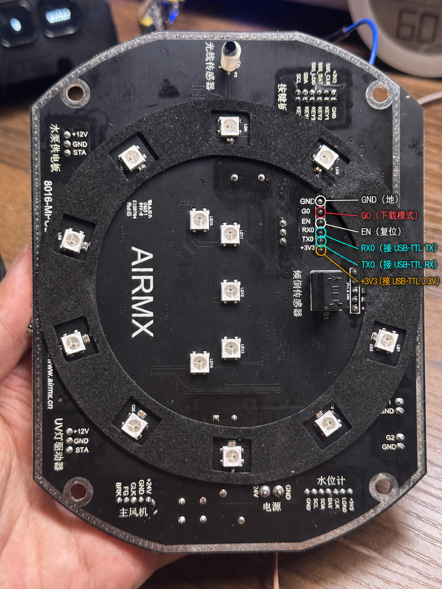

# AIRMX A3 本地固件 v1.3.4

本固件将 AIRMX A3 改为局域网本地控制。首次刷入必须拆机，并准备一个 **3.3V TTL 电平**的 USB-TTL（CP2102、CH340、FT232 等均可）。不要使用 RS-232 电平串口。

完整压缩包可从仓库根目录下载：[`airmx-a3-local-firmware-v1.3.4.zip`](airmx-a3-local-firmware-v1.3.4.zip)。

> [!WARNING]
> 刷机有变砖、接错线损坏主板和失去保修的风险。只适用于 AIRMX A3 的 ESP32-WROOM-32D 主板。操作前先断开 24V 电源；不要带水操作，不要让金属工具造成短路。

## 下载内容

`firmware/v1.3.4/` 内含：

- `bootloader.bin`：写入 `0x1000`
- `partition-table.bin`：写入 `0x8000`
- `ota_data_initial.bin`：写入 `0xe000`
- `airmx-a3-v1.3.4.bin`：首次串口刷机应用镜像，写入 `0x10000`
- `airmx-a3-v1.3.4-ota.bin`：以后在固件网页里升级使用；不能拿它从地址 0 单独刷入空白芯片

## 可修改源码

完整 ESP-IDF 工程位于 [`source/airmx-local`](source/airmx-local/)，包括：

- ESP32 主程序、AIRMX 主板串口协议、本地网络和 OTA 逻辑
- CGG1 蓝牙温湿度计支持和水位趋势估算
- 本地 Web 控制页面源码
- 分区表、ESP-IDF 配置、cJSON 组件和回归测试

源码对应发布版 `v1.3.4`。推荐安装 ESP-IDF 6.0.1，进入源码目录并加载 ESP-IDF 环境后运行：

```bash
./build.sh
./test.sh
```

构建输出默认位于系统临时目录的 `airmx-a3-local-build/`，可通过环境变量 `AIRMX_BUILD_DIR` 改到其他目录。修改热点名称或密码可编辑 `main/local_credentials.h` 后重新构建。

## 1. 拆机

拆机过程参考这个视频：[AIRMX A3 拆机教程（抖音）](https://v.douyin.com/b3MXMla-mPc/)。

注意：

- **机器最下面的底部部分不需要拆。** 按视频拆到能取出/翻开主板并接触 ESP32 调试焊盘即可。
- **白色上半部分外壳非常难撬开。** 先确认可见螺丝均已拆除，再用塑料撬片沿接缝分段松开卡扣。不要只在一个点猛撬，不要用金属螺丝刀深插，以免留下不可逆伤痕、折断卡扣或伤到内部线束。
- 拆开后先拍照记录每个插头的位置和方向，建议用胶带编号，避免装回时插错。
- 主板准备刷机时，**原 24V 电源和主板上的所有外设插头都必须拔掉**。实测只有这样 G0 才能可靠拉低进入下载模式。

## 2. 找到刷机触点

主板背面的 `ESP_Pro` 六个触点从上到下依次为：`GND / G0 / EN / RX0 / TX0 / +3V3`。



## 3. USB-TTL 接线

所有接线都在断电状态下完成：

| AIRMX A3 主板 | USB-TTL | 说明 |
|---|---|---|
| `GND` | `GND` | 共地 |
| `RX0` | `TXD` | 收发交叉 |
| `TX0` | `RXD` | 收发交叉 |
| `+3V3` | `3.3V` | 仅由 USB-TTL 给裸板供电 |
| `G0` | `GND` | 刷机期间保持短接 |
| `EN` | 短暂接 `GND` | G0 已接地且 3.3V 已供电后，短接一次再立即断开，使 ESP32 复位进入下载模式；不要持续接地 |

必须遵守：

- USB-TTL 必须输出 **3.3V**，不可把 `5V` 接到 `+3V3`。
- 此时**绝不能同时连接原 24V 电源**，也不要保留其他外设插头。
- 有些 USB-TTL 的 3.3V 输出能力不足。若连接不稳定、反复掉线或出现 brownout，停止刷写并更换供电能力更可靠的 3.3V USB-TTL；不要改接 5V。
- 不连接 DTR、RTS。接触不牢时建议焊临时排针或使用稳定的测试钩，不要手持导线刷写。

进入下载模式必须按以下顺序操作：

1. 在 USB-TTL 尚未插入电脑时完成其余接线，并保持 `G0 → GND` 短接。
2. 把 USB-TTL 插入电脑，由 USB-TTL 的 `3.3V` 给裸板供电。
3. 保持 G0 接地，用导线将 `EN → GND` **短暂接触一次后立即断开**。EN 的这个复位动作不可省略，否则设备可能不会进入下载模式。
4. 保持 `G0 → GND` 不动，开始运行刷机命令；刷写完成前不要解除 G0 短接。

如果需要重新进入下载模式，不必改动其他接线：继续保持 G0 接地，再将 EN 短暂接地一次并立即断开。

## 4. 安装刷机工具

电脑需安装 Python 3，然后在终端/命令提示符运行：

```bash
python -m pip install --upgrade esptool
```

查找串口：

- Windows：设备管理器中查看 `COM3`、`COM4` 等。
- macOS：运行 `ls /dev/cu.*`，常见为 `/dev/cu.usbserial-xxxx` 或 `/dev/cu.SLAB_USBtoUART`。
- Linux：常见为 `/dev/ttyUSB0` 或 `/dev/ttyACM0`；可能需要串口权限。

## 5. 自动备份并刷写

进入本目录后运行：

```bash
python flash.py 串口名
```

示例：

```bash
# Windows
python flash.py COM3

# macOS
python3 flash.py /dev/cu.usbserial-4120

# Linux
python3 flash.py /dev/ttyUSB0
```

脚本会依次：

1. 校验发布镜像的 SHA-256。
2. 识别 ESP32。
3. 读取并保存一份完整 4MB 原固件备份到 `backups/`。
4. 写入四段 v1.3.4 镜像；**不会执行全片擦除**。
5. 再次逐段校验。

完整备份可能含 Wi-Fi 密码和设备标识，不要上传或分享。

如果一直出现 `No serial data received`，按顺序检查：所有外设和 24V 是否已拔掉、G0 是否确实与 GND 导通、是否在 3.3V 供电后执行了 **EN 短暂接地再断开**、TX/RX 是否交叉、串口名是否正确。需要重试时保持 G0 接地，再让 EN 短暂接地一次并立即断开，然后重新运行刷机命令。

## 6. 刷完恢复与首次连接

看到“刷写和校验完成”后：

1. 拔掉电脑上的 USB-TTL。
2. 拆除 `G0 → GND` 短接线；不拆会一直停在下载模式。
3. 拆除 USB-TTL 的其余接线。
4. 按拆机前照片恢复所有外设插头并检查方向。
5. 装回外壳后，最后再接原 24V 电源开机。
6. 手机或电脑连接热点 `AIRMX-A3-Local`，密码 `6dc236dae48c`，浏览器打开 `http://192.168.4.1/`。
7. 在设置页配置家庭 Wi-Fi。设备接入家庭网络后，可在路由器客户端列表中查看它的 IP。

## 7. 后续 OTA 升级

设备网页仍能打开时，不必再次拆机。在设置页选择 `airmx-a3-v1.3.4-ota.bin` 上传，等待写入、重启完成。升级期间不要断电；OTA 文件不能作为首次完整串口刷机包使用。

## 校验值

见 [`SHA256SUMS`](firmware/v1.3.4/SHA256SUMS)。

## 已知边界

- v1.3.4 已在原板 OTA 启动，并验证基础控制、网络、协议和水位趋势逻辑。
- 剩余时间是根据水位下降趋势估算；真实容量尚未标定，首次运行或数据不足时会显示 `∞`。
- 请保留刷机前 4MB 备份。固件异常时仍可用相同接线进入下载模式恢复，但硬件损坏不在软件恢复范围内。
